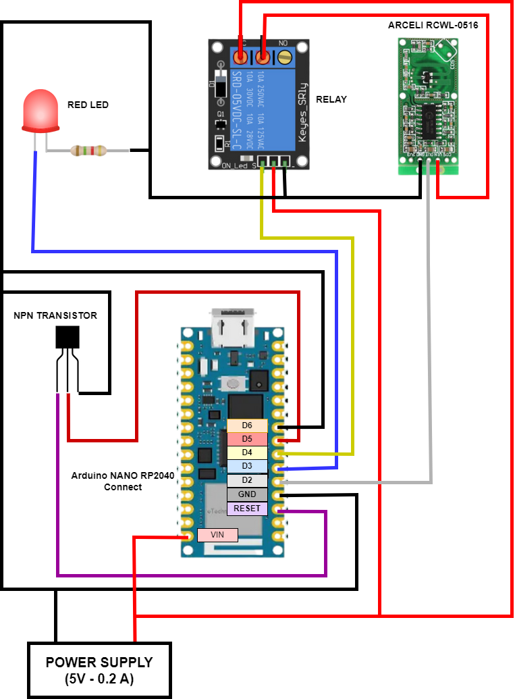

# Homemade Home Alarm - IoT Project

The aim of this IoT project is to create an indoor alarm system. The idea is to use several sensor nodes (number undefined) that each have the task of monitoring a room or area. The architecture is centralised, in fact there is a master node that coordinates all operations by communicating with the sensor nodes, provides user interfaces and keeps the system status.

## Sensor Node

### Architecture

<p align="center">
  
</p>

Components:
* Arduino Nano RP2040
* Arceli RCWL-0516: The mirowave radar
* Relay: It is used to disconnect the microwave radar in order to save energy
* Red Led: It's on if movement is detected
* NPN Transistor: It is used to reset the Arduino board
* Power Supply

### Behavior in pseudo-code

```
fun main():
    
    register_itself_to_master()
    set_keep_alive_timeout()

    loop:
        if keep_alive_timer_expired:
            send_to_master(keep_alive)
            reset_keep_alive_timeout()

        if new_msg_is_available:
            case new_msg:
                'RESET' -> 
                    reset()
                'ON' ->
                    activate_microwave_radar_relay()
                    set_alarm_on()
                'OFF' ->
                    deactive_microwave_radar_relay()
                    set_alarm_off()
                'STATUS' -> send_status()
            end

        if alarm_is_on():
            if new_movement_detected():
                send_to_master(DETECTED)
            if movement_no_longer_detected():
                send_to_master(FREE)
```

## Master Node

### Architecture

<p align="center">
  
</p>

Modules:
* **UDP Server**: Receive and send messages from/to Sensor Nodes
* **Thread-safe Message Queue**: It stores the messges received from Sensor Nodes
* **Chache Manager**: It manages the system status reading and writing a json file
* **Alarm Manager**: It tracks movement detections, alarm status and decides if the siren alarm has to be activated or not
* **Protocols Module**: It contains all protocols that can be runned by other modules
* **Message Manager**: It performs different actions depending on the type of message extracted from the queue
* **Telegram Bot Manager**: It allows admin to interact with the system via Telegram
* **CLI Manager**: It allows admin to interact with the system via terminal
* **Web Server**: It allows admin to interact with the system through a web app

### Telegram Interface

<p align="center">
  
</p>

### Web App Interface

<p align="center">
  
</p>

## Author
Gianluca Gemini (gianlucagemini98@gmail.com)